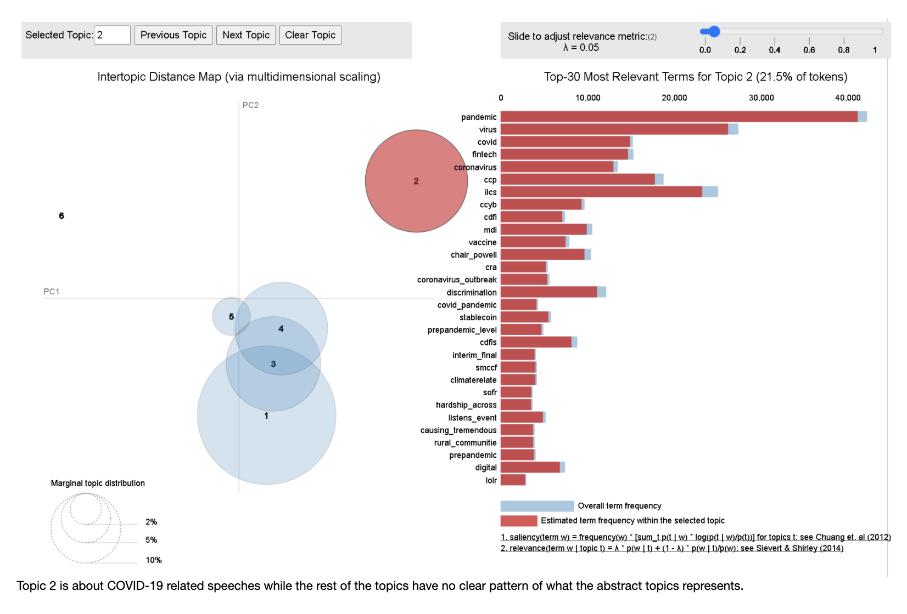
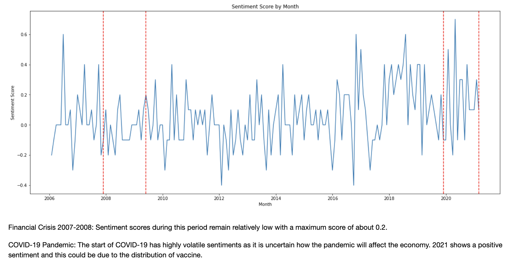
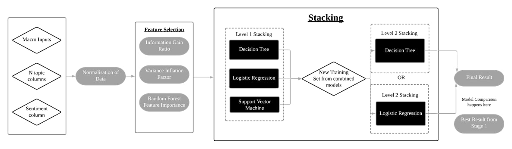

# BT4222 Group 10 Project

BT4222 Mining Web Data for Business Insights

### Description

Effectiveness of Machine Learning and Text Mining Techniques in Predicting Federal Funds Rate Movement

### Setup

`pip install -r requirements.txt`

*Note: Activate a virtual environment before running pip install*

### Notes

Please take note that the data file "raw_data.txt" contains the initial macroeconomic data and textual data. However,
since the amount of textual data collected caused the file to become larger than 100 MB, we were unable to push it to
the Github Repository. Instead, we have uploaded the file onto dropbox where subsequent notebooks will read.csv from the
link (refer to below).

Dropbox link: https://www.dropbox.com/s/l0y4g1t96ry4eyn/raw_data.txt?dl=1

Moreover, some notebooks were ran with google colab since some code took longer to run. Therefore, the environment might
be different from your local environment.

## 00 Project Overview

### Introduction

Our project involves the application of relevant text mining and machine learning techniques to forecast the direction
of the federal funds rate in the United States.

### Project Context

The federal funds rate is an important monetary policy tool that can be used to control economic activity in the
country. For instance, the Central Bank can increase the federal funds rates to battle inflation and prevent an
overheating economy. On the other hand, it can reduce the federal funds rate to stimulate economic growth. Lower
interest rates reduce the borrowing cost and incentives investors to invest in the country, directing foreign capital
into the country. Additionally, it reduces the incentives for saving which bolsters domestic consumption.

In the U.S., federal funds rates are determined by the Federal Open Market Committee (FOMC). Each year, the FOMC meets
eight times to determine the near-term direction of monetary policy and interest rates. During each meeting, the federal
funds rate is discussed, voted and determined between members of the FOMC. After each meeting, the FOMC subsequently
publishes official records of the statements, minutes and testimonials on its website, establishing their view on the
current economic situation and other related matters. These discussions are key to their resultant vote on whether to
lower, hold or increase the federal funds rate.

### Project Motivation

Many conventional methods of prediction in the finance industry involve statistical use of numerical data such as
macroeconomic indicators or country-level aggregates. Over the years, the amount of textual data being collected has
grown, and our group is hoping to explore the use of NLP in this field. We feel that NLP offers promising insights and
can become a strategic tool for financial analysis. Therefore, our goal is to evaluate the effectiveness of using FOMC
textual data to improve the prediction of federal funds rate movement.

## 01 Data Collection

Run the following command to scrape data and write it to the respective folders.

*Note: Running this will overwrite existing files, so only run this if you are sure you want to overwrite the files.*

`python scripts/01_Data.py -t overwrite`

Run the following command to merge existing data.

`python scripts/01_Data.py -t merge`

### Macro Data

Macroeconomic indicators are statistics or data readings that reflect the economic performance of an economy,
government, or sector. Depending on its nature, each indicator can be classified as a leading or lagging indicator. It
is important to look at macroeconomic data as it provides a representation of the overall health of the economy and
might potentially offer insights into the direction of the Effective Federal Funds Rate.

Key macroeconomic data of the US was downloaded using the FRED API, which is a web service that facilitates the
retrieval of economic data from the Federal Reserve Economic Data (FRED) and Archival Federal Reserve Economic Data (
ALFRED) websites hosted by the Economic Research Division of the Federal Reserve Bank of St. Louis. Requests could be
customized according to the data source, release, series and other preferences. Using the API, we retrieved 7
macroeconomic indicators – Real GDP, Consumer Price Index (CPI), Unemployment rate, Total Nonfarm payrolls (Employment),
Real Retail and Food Services Sales, Federal Debt, CBOE Volatility Index (VIX) that were commonly used to analyse a
country’s economic situation, along with the Effective Federal Funds Rate.

FRED API: https://fred.stlouisfed.org/docs/api/fred/

### Textual Data

Since sentiment analysis is one of the NLP methods that we are looking to apply, our team looked for textual data that
would be valuable. The main stakeholder involved in the determination of the federal funds rate is the FOMC itself, and
therefore analysing the official records of each meeting would potentially provide insights.

The FOMC website regularly updates 6 crucial materials after each meeting, namely the meeting statements, meeting
minutes, meeting transcripts, press conference transcripts, speeches and testimonies. To retrieve these textual data
required for our project, we developed python scripts to perform the web-scrape function. We made use of popular
web-scraping libraries like Requests and Selenium to make HTTP requests and launch web drivers respectively.
BeautifulSoup was used in tandem to parse the data, allowing us to extract the relevant data from the HTML content.

FOMC website: https://www.federalreserve.gov/monetarypolicy/fomc.htm

## 02 Preprocessing with Exploratory Data Analysis (EDA)

In this notebook, we conduct some preliminary preprocessing of textual data and explore that data that was collected in
01_Data.py.

Inputs:

- (local) ../data/raw_data.txt or (dropbox) https://www.dropbox.com/s/l0y4g1t96ry4eyn/raw_data.txt?dl=1

Outputs:

- None

### Macroeconomic data

#### Time-series plots

#### Density plot

#### Correlation plot

### Textual data

#### Number of posts by type of textual data

#### Word cloud

#### Word frequency chart

## 03 Feature Engineering with LDA Topic Modelling

In this notebook, we preprocess the textual data and explore the use of LDA Topic Modelling to feature engineer new
columns.

Inputs:

- (local) ../data/raw_data.txt or (dropbox) https://www.dropbox.com/s/l0y4g1t96ry4eyn/raw_data.txt?dl=1

Outputs:

- ../data/text_features/lda.csv

Process:

- Text Preprocessing
    - Removal of punctuation
    - Lower-casing and stripping of whitespace
    - Removing integers
    - Removal of stopwords
    - Tokenizing
    - Bi-grams
    - Lemmatisation
- LDA Topic Modelling
    - Train test split
    - Data transformation
    - Building the baseline LDA model
    - Using c_v Ccoherence Score to evaluate LDA topic model performance
    - Hyperparameter Tuning (Grid Search)
    - Visualisation of topics
    - Feature engineering

#### Screenshot of Topic 2 of LDA Topic Modelling

## 04 Feature Engineering with FinBert Sentiment Analysis

In this notebook, we also preprocess the textual data and explore the use of both Naive Bayes classifier and FinBert to
generate sentiments from the textual data in order to feature engineer new columns.

Inputs:

- (local) ../data/raw_data.txt or (dropbox) https://www.dropbox.com/s/l0y4g1t96ry4eyn/raw_data.txt?dl=1

Outputs:

- data/text_features/sentiments.csv

Process:

- Creating a Bert classification model with pretrained FinBert weights
- Comparing the performance with a Naive Bayes classifier that was pre-trained on a 10,000 analyst sentiment datatset
- Text Summarization using LexRank
- Visualisation of sentiment scores over time

#### Sentiment Scores by Month

## 05 Baseline Macro Classification

In this notebook, we will build a baseline model that makes use of solely macroeconomic data (7 columns) for
classification.

Inputs:

- ../data/macro/macro.csv

Outputs:

- ../data/target/target.csv

Process:

- Preprocessing of macroeconomic data
- Train test split
- Feature scaling
- Creating the baseline model
- Evaluation of model using F1-weighted score

## 06 Final Model

In this notebook, we will make use of the macro inputs, N topic columns generated from LDA topic modelling, FinBert
sentiment columns. Normalisation of numerical data is conducted. Feature selection is subsequently conducted to select
important features. After which, we stack 3 different classifiers - Decision Tree, Logistic Regression, Support Vector
Machine in Level 1 to create a new training (predictions) which are used as the inputs for Level 2 stacking which uses a
Decision Tree or Logistic Regression model. The resultant model is evaluated against the baseline model in 05 Notebook
using F1-weighted score.

Inputs:

- ../data/macro/macro.csv
- ../data/target/target.csv
- ../data/text_features/lda.csv
- ../data/text_features/sentiments.csv

Outputs:

- ../data/combined/combined.csv

Process:

- Feature normalisation
- Feature selection
    - Variance inflation factor
    - Random forest feature importance
    - Information gain ratio
- Stacking classifiers
- TimeSeriesSplit Cross-Validation

#### Flowchart for 06 Notebook

## 07 Feature Engineering Macro with Final Model

In this notebook, we will feature engineer our macro inputs to create new columns such as percentage difference, simple
moving averages, exponentially weighted moving averages. The same steps in 06 Notebook will be applied here.

Inputs:

- ../data/combined/combined.csv

Outputs:

- ../data/combined/final_combined.csv

Process:

- Feature engineering of macroeconomic inputs
    - Percentage difference
    - Simple Moving Averages (SMA)
    - Exponentially Weighted Moving Averages (EWM)
- Feature normalisation
- Feature selection
    - Variance inflation factor
    - Random forest feature importance
    - Information gain ratio
- Stacking classifiers
- TimeSeriesSplit Cross-Validation

#### Flowchart for 07 Notebook

## 08 Exploring Hypotheses

Inputs:

- (local) ../data/raw_data.txt or (dropbox) https://www.dropbox.com/s/l0y4g1t96ry4eyn/raw_data.txt?dl=1
- ../data/text_features/lda.csv
- ../data/target/target.csv
- ../data/text_features/sentiments.csv
- ../data/combined/combined.csv
- ../data/combined/final_combined.csv

Outputs:

- None

Hypotheses:

1. “Movement of the Fed fun is more dependent on the speaker than the nature of the event.”
2. “Movement of the Fed fund is dependent on the compound sentiment score of words used in the event rather than the
   nature of the event.”
3. “Macroeconomic data will have more predictive powers than Textual data in terms of predicting Fed Rate movement”¶
